# projetoES

TOKEN DO ADMIN (ÚNICO): <strong>5ry%tL#PLJ7AYhf%kyss$B</strong>

observação importante: faça a navegação entre as páginas utilizando os botões disponiveis na tela!

<h2>Descrição textual do sistema</h2>

O nosso sistema se chama: GitPlus. Ele é uma simulação de uma plataforma de streaming, na qual os usuários podem ser: comuns, VIPs ou ADMs do sistema (IREI FALAR POSTERIORMENTE DOS BENEFÍCIOS DELES), nossa página main (na qual contém todos
  os vídeos) é composta por vídeos que são subdivididos em categorias, que são: my list (lista do usuário <strong>cada usuário / cada perfil tem a sua própria lista, adicionando ou removendo filmes.</strong>), em alta (top 5 melhores vídeos atuais), series e filmes (series e filmes são subdividios em:
  cartoon, action e fiction).

Contextualizando sobre os usuários, o usuário comum ele possui apenas UM perfil quando ele faz o login na sua conta, na qual a imagem do perfil pode ser customizada (isso vale para todos os usuários). Já o usuário VIP, ele possui TRÊS perfils na sua conta
sendo nomeado quando o usuário criar a conta, além disso, nessa criação de conta, o usuário vai receber um TOKEN VIP, que o usuário VIP deve salvar para conseguir fazer o login no sistema com a sua conta. Já a parte do ADM do sistema, ele vai ter acesso ao BACK-END dos filmes, podendo assim adicionar ou remover qualquer filme que ele quiser, é mostrado nessa página também, uma tabela com todos os filmes que estão no nosso website. (colocamos o ADM como um usuário, pois o ADM também possui uma conta! logo, ele também é usuário e pode usufruir do sistema) para fazer o login na página ADMIN, o usuário deve colocar: nome ou email, senha e o seu TOKEN ADMIN (único para todos).

É importante deixar claro que, como o nosso website é uma simulação, <strong>todos os vídeos que a gente colocou foram: IFRAMES. pois, foi a melhor solução que achamos para fazer a simulação, já que colocar vários filmes seria extremamente pesado e o download do mesmo seria demorado.</strong>

Esse é o nosso sistema, uma simulação simples que faz uso de uma API rest no back4app com os filmes e usuários. <strong>(todas as imagens foram geradas por I.A)</strong>

<h2>Figura do Diagrama de Casos de Uso</h2>

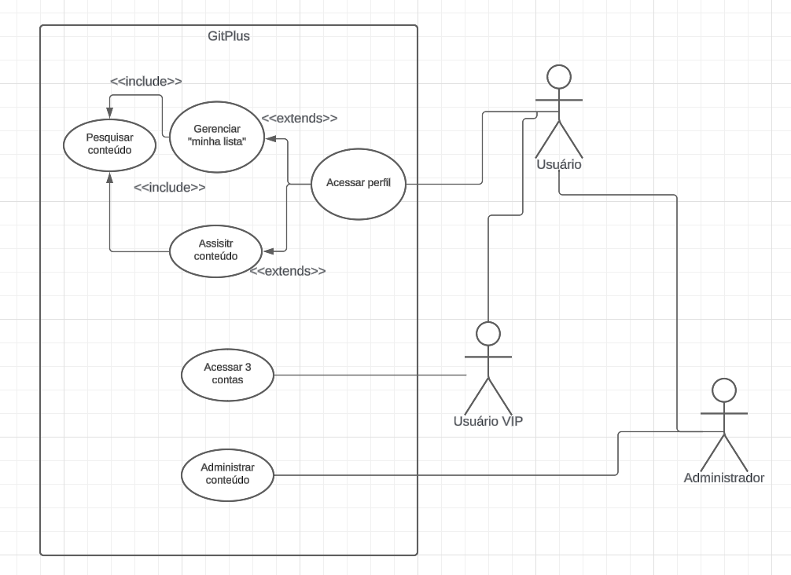

<h2>Figura do Diagrama de Classes do sistema</h2>

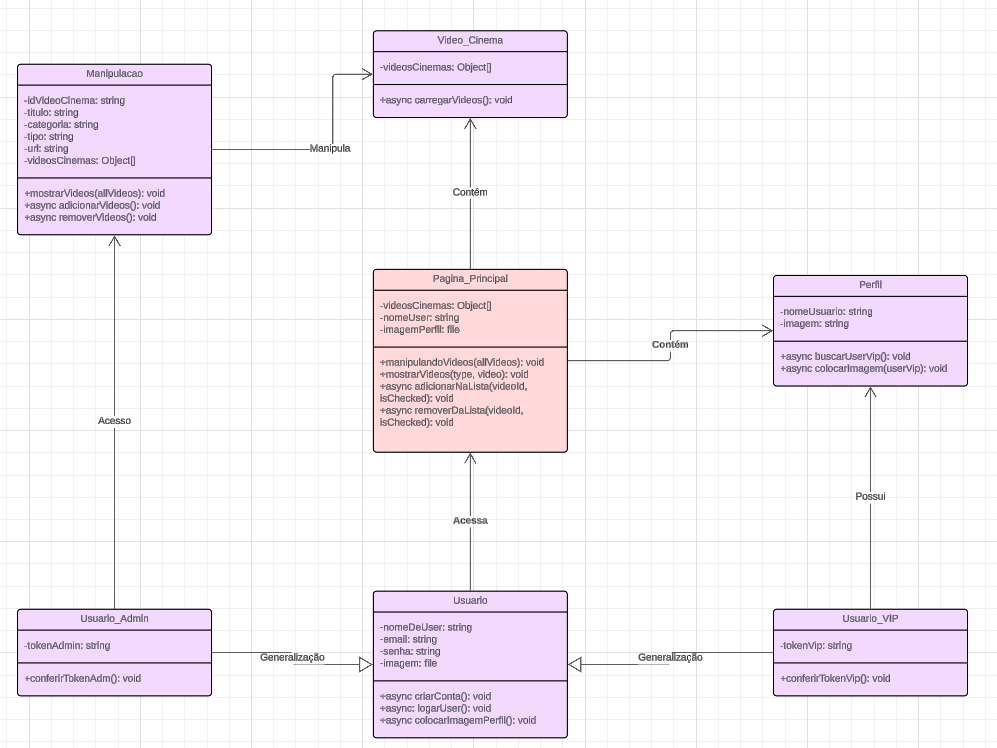

<h2>Figura do Modelo Relacional</h2>

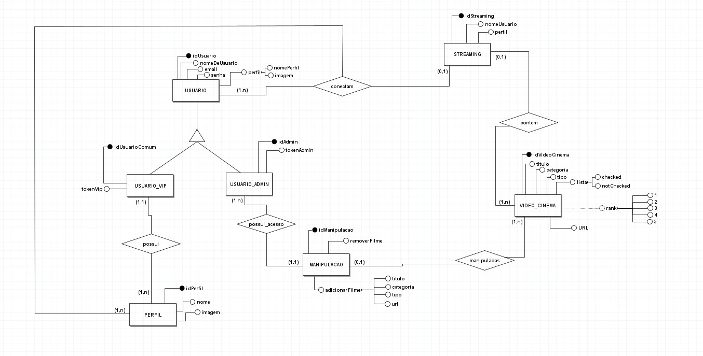

<h2>Captura de Tela do sistema</h2>

irei mostrar várias capturas

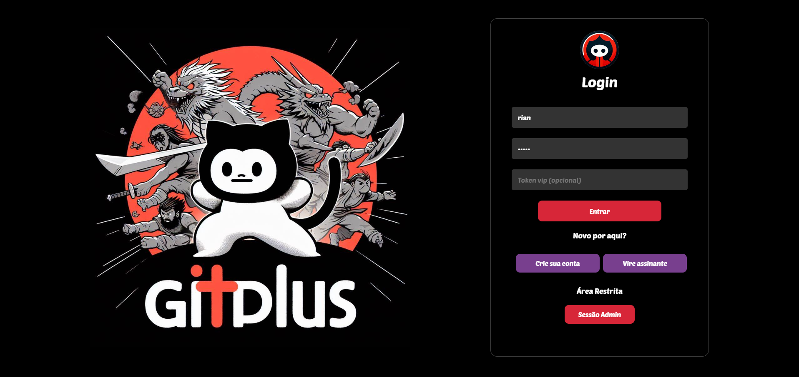
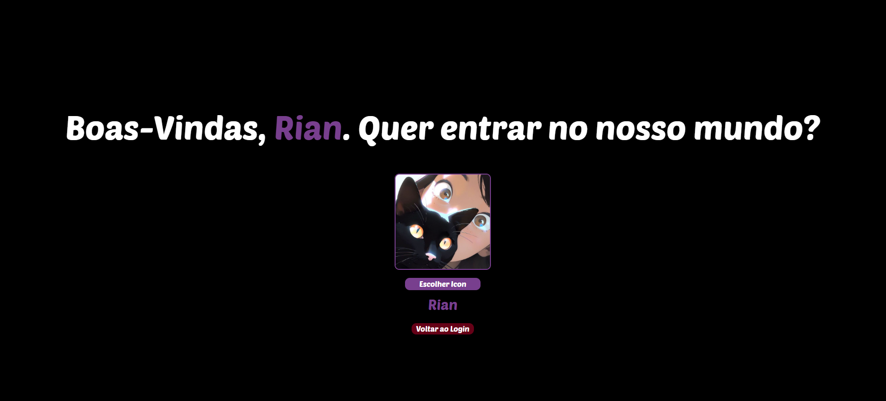
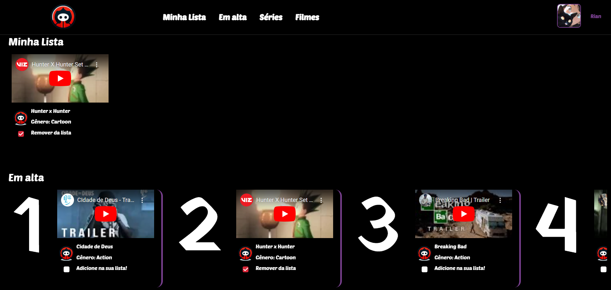
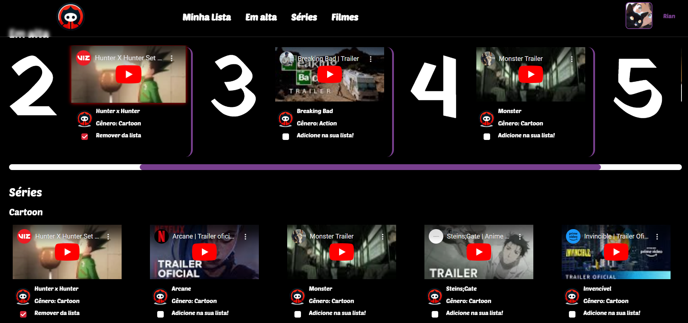
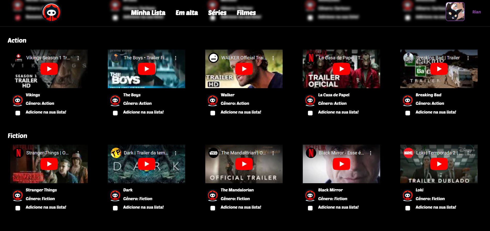
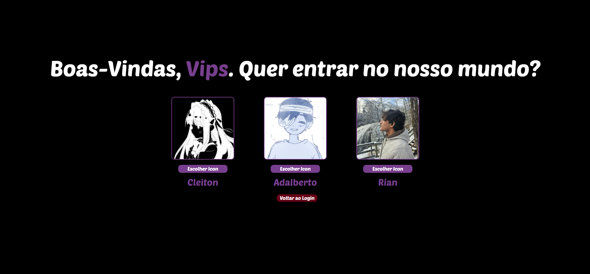
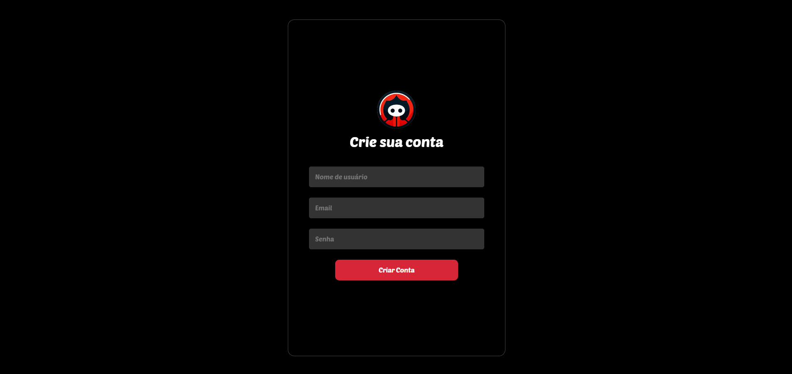
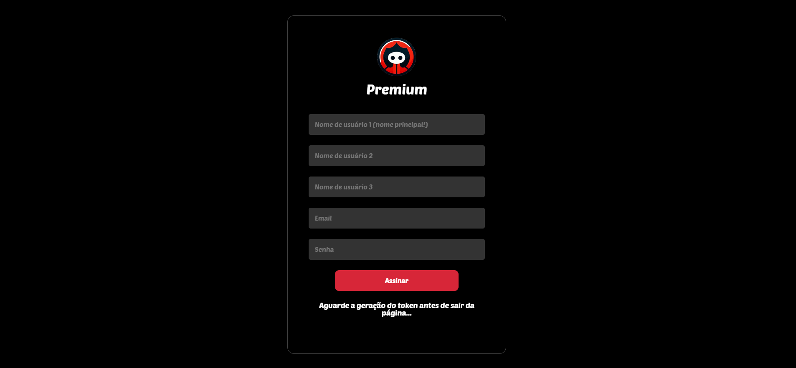
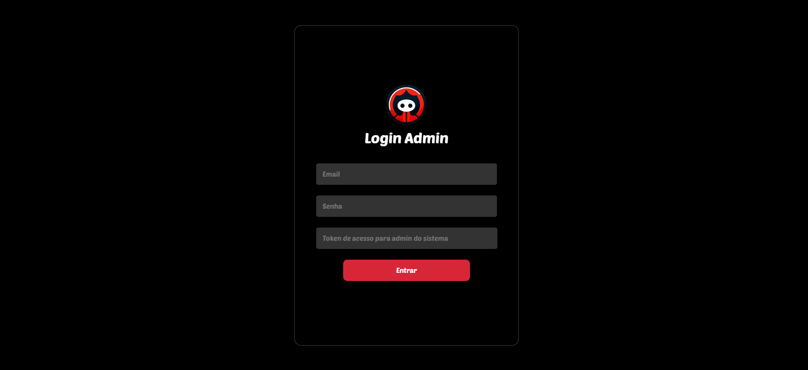
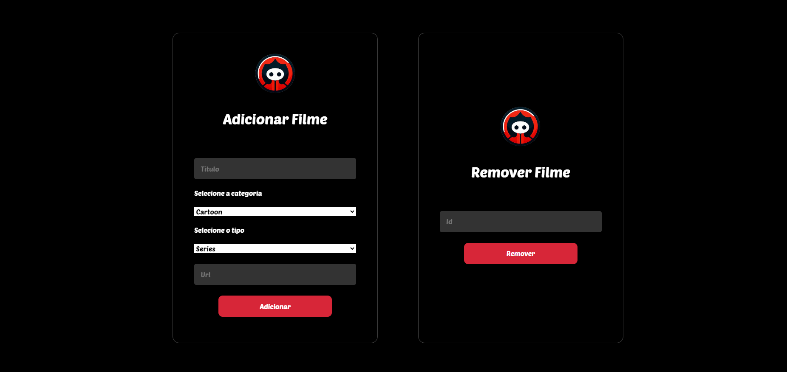
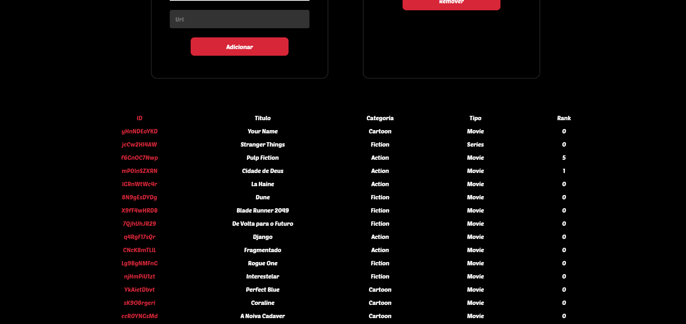

